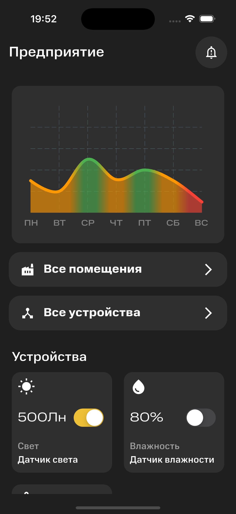

# IoT Control – Flutter App for Hackathon MTC

[](https://flutter.dev/)
[](https://bloclibrary.dev/)

## 📌 О проекте

**IoT Control** – это мобильное приложение для мониторинга и управления IoT-устройствами на фабриках и предприятиях.  
С его помощью можно следить за состоянием датчиков в помещениях и получать аналитические данные в реальном времени.

## 🚀 Возможности

- Подключение и мониторинг IoT-устройств
- Графики и аналитика полученных данных
- Уведомления о критических изменениях показателей
- Централизованное управление оборудованием  

## 🛠️ Технологии

- **Flutter** – кроссплатформенная разработка
- **BLoC** – управление состоянием
- **Dart** – язык программирования
- **REST API / WebSocket** – получение данных  

## 📸 Скриншот главного экрана



## 📦 Установка

```sh
git clone https://github.com/your-repo/iot-control.git
cd iot-control
flutter pub get
flutter run
```

## 📞 Обратная связь

Если у вас есть вопросы или предложения, создавайте issue или pull request.  
